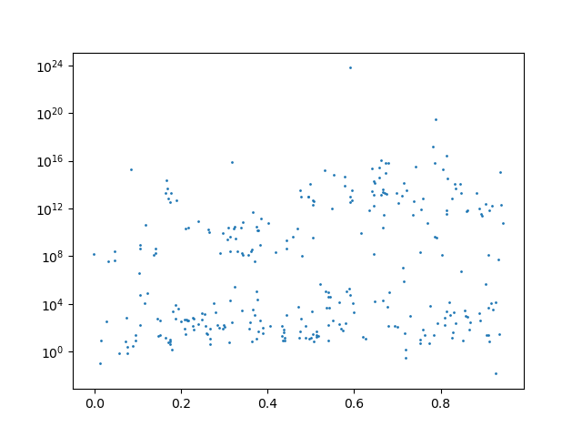

# Tutorial

## WEAVE objects

* An OB holds all the information that pertains to making an observation: the targets, the conditions, the instrument configuration. You can locate specific OBs with their obid `data.obs[obid]`

* An Exposure is one integration of both arms of the spectrograph. You can locate Exposures like so:  `data.exposures[mjd]`

* A Run is a weave term for an exposure taken in one arm of the spectrograph (so there are always 2 Runs per Exposure). You can locate runs using their runid `data.runs[runid]`.

* A `spectrum` in weaveio refers to a single spectrum of a single target (not the block of `spectr*a*`)

* An L1 product refers to the spectra recorded in an L1File. All L1 data is separated by camera colour (red and blue). 
    * A single spectrum is the processed spectrum from the raw data
    * A stack spectrum is the spectrum resulting from stacking two or more single spectra in a single ob
    * A superstack spectrum results from stacking *between* OBs but with the same instrument configuration
    * A supertarget spectrum results from stacking every single spectrum of a single Weave_Target cname.
  
* An L2 product refers to analysis products performed by Redrock, Gandalf, PPXF, RVSpecFit, and Ferre.
* Each one of these fits has a model spectrum and analysis output (such as line indices)
* Each L2 product has at least 2 corresponding L1 products since the red and blue spectra are joined together for the analysis.

* There are three types of `target`
    1. `weave_target` is the unified target based on ra, dec. They have a unique CNAME
    2. `survey_target` is a target specified by a survey in a `survey_catalogue` (they reference a single `weave_target`). These are unique to a catalogue.
    3. `fibre_target` is a result of assigning a spectrograph `fibre` to a `survey_target`. These are unique to an OBSpec.
    

### What is an attribute? What is an object? What is a product?

* weave.io is an object orientated query language using a neo4j database hosted at lofar.herts.ac.uk. 
* weave.io stores 4 (+1) types of object:
    1. File - A reference to a physical fits file on the herts system (it also stores references to individual fits.HDUs and their headers as separate objects, but the user doesn't need to know of their existence to use weave.io)
    2. Object - A object that references a concept in the WEAVE universe that has attributes (an OB object has an obid attribute, an exposure object has an attribute expmjd
    3. Attribute - A piece of data that belongs to some object
    4. Product - A special type of attribute which references binary data not stored in the database itself (e.g. spectrum flux). You cannot perform arithmetic/indexing on product attributes.


### Running a query
A query finds the locations of all the L1/L2/Raw products that you want. 
It is analogous to an SQL query except that it is written in Python.

* A query is constructed using python like so:

    ```
    from weaveio import *
    data = Data(username, password)
    
    runs = data.obs[obid].runs
    reds = runs[runs.colour == 'red']
    spectra = reds.l1singlespectra
    ```
    `runs`, `reds`, `spectra` are all queries
* Each part of this query can be run independently, using the parentheses:
    * `runs.runids` is still a query 
    * `runs.runids()` returns an actual list of numbers
    * `reds()` will return a list of Run objects (containing all attributes of a run)

# Examples of use:

# 1. I want to return the number of sky spectra in a given run (runid=1002850)


```python
from weaveio import *
data = Data() 
runid = 1003453
nsky = sum(data.runs[runid].targuses == 'S')
print("number of sky targets = {}".format(nsky()))
```
output: `number of sky targets = 100`

We can break this down into several steps:
1. `from weaveio import *; data = Data()` - Import all the necessary `weaveio` functions and start the default lofar database link.
2. `data.[...]` - Start building a query using the default database.
3. `data.runs` - The query starts at all runs.
4. `data.runs[runid]` - Filter the runs to those that have the id equal to `runid`. This is unique, so you can be sure that this query now contains one row.
5. `data.runs[runid].targuses` - Each run has multiple L1 single spectra associated with it and each of those spectra have a `targuse` attribute. Therefore, each run has a `targuses` attribute. 
6. `data.runs[runid].targuses == 'S'` - Make a boolean mask for where the targuse flag for each spectrum belonging to this run is set to `'S'` (this refers to "sky").
7. `nsky = sum(data.runs[runid].targuses == 'S')` - Sum the entire boolean mask, thereby counting the number of sky fibres placed in this run. 
The python function `sum` was overwritten with a `weaveio` version when we did our imports. `sum` is now compatible with `weaveio` but can also be used normally. 
8. `nsky()` - Up til now, we have been building a query, much like we would write SQL, but nothing has executed on the database yet. 
To run our query and fetch the result, we call it using the parentheses `()`.

## 1b. I want to see how many sky targets each run has
```python
from weaveio import *
data = Data()
nsky = sum(data.runs.targuses == 'S', wrt=data.runs)  # sum the number of sky targets with respect to their runs
print(nsky())
```
output: `[100 299 299 100 100 200 160 ...]`
This query is very similar to the previous one except that we are summing along an axis (to use a `numpy` phrase).
The difference here is that we have missed out `data.runs[runid]` which means that our query references all `runs` in the database at once.
1. `from weaveio import *; data = Data()` - Import all the necessary `weaveio` functions and start the default lofar database link.
2. `data.runs` - The query starts at all runs.
3. `data.runs.targuses == 'S` - Access all `targuse` attributes belonging to this run, which are *per l1 single spectrum*
4. `nsky = sum(data.runs.targuses == 'S', wrt=data.runs)` - This time sum our boolean mask *with respect to (`wrt`)* `data.runs`. 
This means each row in the resultant query, `nsky`, will refer to each row in `data.runs`. I.E. There is now a query row *per run*, whereas in the previous example there was only one row.

## 1c. Put the above result into a table where I can see the runid
```python
from weaveio import *
data = Data()
nsky = sum(data.runs.targuses == 'S', wrt=data.runs)  # sum the number of skytargets with respect to their runs
query_table = data.runs[['id', nsky]]  # design a table by using the square brackets
concrete_table = query_table()  # make it "real" by executing the query
print(concrete_table)
print(type(concrete_table))
```
output:
```
   id   sum0
------- ----
1003453  100
1003440  299
...      ...
<class 'weaveio.readquery.results.Table'>  # although this is an astropy table really
```
Returning more than one attribute per row requires "designing" a table.
To do this, we put a list of our required values in the square brackets `[['id', nsky]]`. 
Any string referring to an attribute (e.g. `'id'`) can go here as well as any previously written query (e.g. `nsky`').
However, any items that you put in the square brackets must align with the object outside:

For example:
* `data.runs[['id', nsky]]` is valid because each `run` has an `id` and the query `nsky` is based on `data.runs` (i.e. each `run` has an `nsky` calculated for it).


# 2. I want to plot all single sky spectra from last night in the red arm

```python
from weaveio import *
data = Data()
yesterday = 57811  # state yesterday's date in MJD

runs = data.runs
is_red = runs.camera == 'red'
is_yesterday = floor(runs.exposure.mjd) == yesterday  # round down to an integer, which is the day

runs = runs[is_red & is_yesterday]  # filter the runs to red ones that were taken yesterday  
spectra = runs.l1single_spectra  # get all the spectra per run
sky_spectra = spectra[spectra.targuse == 'S']  # filter to the spectra which are sky 

table = sky_spectra[['wvl', 'flux']]  # design a table of wavelength and flux

import matplotlib.pyplot as plt
# this may take a while to plot, there is a lot of data
for row in table:  # you can iterate over a query with `for` as well as requesting the whole thing with `()` 
    plt.plot(row.wvl, row.flux, 'k-', alpha=0.4)  # standard matplotlib line plot 
plt.savefig('sky_spectra.png')
```
output:


# 3. I want to plot the H-alpha flux vs. L2 redshift distribution from all WL or W-QSO spectra that were observed from all OBs observed in the past month. Use the stacked data

```python
import matplotlib.pyplot as plt
data = Data()
l2s = data.l2stacks
l2s = l2s[(l2s.ob.mjd >= 57780) & any(l2s.fibre_target.surveys == '/WL.*/', wrt=l2s.fibre_target)]
l2s = l2s[l2s['ha_6562.80_flux'] > 0]
table = l2s[['ha_6562.80_flux', 'z']]()
plt.scatter(table['z'], table['ha_6562.80_flux'], s=1)
plt.yscale('log')
plt.savefig('ha-z.png')
```


Let's break down this query:

1. `l2s = data.l2stacks` gets all l2stack products in the database. These are the data products which contain joined spectra and template fits.
2. `l2s.fibre_target.surveys == '/WL.*/'` - This creates a boolean mask matching the survey name to 'WL.*' with regex. You can activate regex by using `/` at the start and end of a string.
3. `l2s = l2s[(l2s.ob.mjd >= 57780) & any(l2s.fibre_target.surveys == '/WL.*/', wrt=l2s.fibre_target)]` - This filters to l2 products whose L1 observations were taken after 57780
and survey names containing "WL"
4. `l2s = l2s[l2s['ha_6562.80_flux'] > 0]` - Then we further filter the l2 products by required an halpha flux greater than 0 (fit by Gandalf).
5. `l2s[['ha_6562.80_flux', 'z']]` - This designs a table with the halpha flux (from gandalf) and the redshift (from redrock)


# 4. Join a local catalogue
I have a FITS catalogue with two columns, CNAME and POI (parameter of interest) for let’s say 300 sources. I wish to see how POI relates to what’s in the L1 and L2 data products for any data with matching CNAMES. 
1. Read in 3rd party FITS table
2. Join by CNAME to matching CNAMEs in the database
3. Print the dates on which those matched objects were observed, and the number of WEAVE visits to each CNAME (there could be more than one)
4. Plot POI against L1 property (e.g. mean flux between 400-450nm would be a nice one to see)
5. Plot POI against L2 property (e.g. redshift, displaying only those with ZWARN == 0)

```python
import matplotlib.pyplot as plt
data = Data()
# make a local table to test this example
from astropy.table import Table, hstack
table = Table({'id': ['WVE_20325171+6119448', 'WVE_20324198+6043170',
                   'WVE_20334179+6129158', 'WVE_20333204+6107068',
                   'WVE_20325378+6044165'], 'poi': [1,2,3,4,5]})
targets = data.weave_targets[table['id'].data.tolist()] # weave_target is identified by cname TODO: `.data.tolist()` should be unnecessary
nobs = count(targets.obs, wrt=targets)
z = mean(targets.zs, wrt=targets)

query = targets[[targets.cname, targets.obs.mjd, nobs, z]]
joined = hstack([table, query()])
joined.rename_columns(['count0', 'avg0'], ['number of obs', 'average l2 reshift'])  # TODO: give column names in the query
```
This query can be broken down into 


## Details

## If confused, ignore...

### object/attribute 
weave.io uses Python syntax to traverse a hierarchy of objects and their attributes. 
It is important to note that objects are linked to other objects (e.g. a run belongs to an OB and also to an exposure, which itself belongs to an OB). 

You can stitch together these objects to form a hierarchy of objects:

`run <-- exposure <-- ob <--obspec(xml)`

Every OB is a parent of multiple Exposures which in turn are parents exactly 2 runs each (one red, one blue).

Because of this chain of parentage/relation, every object has access to all attributes where there is a chain, as if they were its own attributes.


### Traversal syntax 

1. You can request any directly owned attribute of an object 
    * An OB has an id: `ob.id`
    * An obstemp has a maxseeing `obstemp.maxseeing` 
    
1. You can request any attribute of objects that are further away in the hierarchy as if it were its own. This is useful because a priori you wouldn't be expected to know where any particular piece of data is stored, just that it exists.
    * `run.maxseeing` is identical to `run.exposure.ob.obspec.obstemp.maxseeing`

1. Traversal works in any direction
    * You can go down a hierarchy: `exposure.runs.raw_spectrum` (exposure has multiple runs)
    * You can go up as well: `raw_spectrum.run.exposure` (raw_spectrum has one run)

1. Traversal can be implicit like with the indirectly accessed attributes above
    * You can skip out stages: `run.obspec` is identical to `run.ob.obspec`
    
1. Traversal requires you to be aware of plurality/multiplicity (neo4j calls this cardinality):
    * A run only ever has a single ob, so you query it using a singular name: `run.ob`
    * But an ob will typically have multiple runs, so you must use plural names: `ob.runs`
    * weave.io is aware of plurality of the whole hierarchy, so it will shout at you if you are obviously wrong: `ob.run` will fail before you even execute the query.

1. Traversal name plurality is relative
    * A run has a single ob, which in turn has multiple runs: `run.ob.runs` will return all runs of the ob (including the one that was explicitly referenced at the start). 
    * `ob.runs.weave_target.obs` can be read as "**For each** of the runs, get its weave_target, and then **for each** weave_target get all OBs which assign a fibre to that target."

1. Traversal using dot syntax always increases/maintains the total number of rows returned at the end
    * A consequence of traversal is the building up of rows. This is useful to get properly aligned labels/indexes for things.
    * `ob.runs.ob.runs.ob.runs` will return not simply return the runs of this ob, but rather a huge duplicated list because each time you use the '.' syntax, we are saying **"for each"**


### Identifiers

1. You can request a specific object if you know its id 
    * `one_ob = data.obs[obid]` 
    * `a_list_of_obs = data.obs[[obid1, obid2, obid3]]` 
    * Plurality still applies here: `data.weave_targets.obs[obid]` will return one ob **for each** weave_target
        * `data.obs[obid].weave_targets` returns all weave_targets for this particular ob
        * `data.weave_targets.obs[obid]` returns the ob with obid for each weave_target (sometimes will be None)


