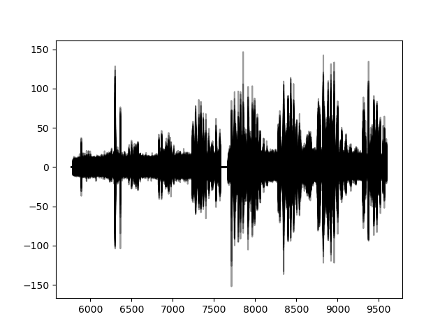
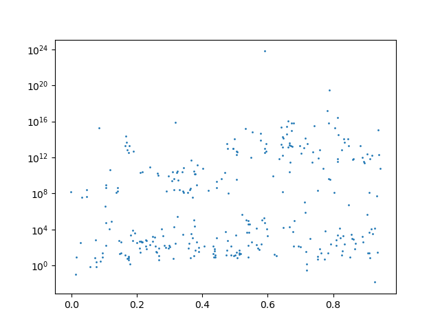
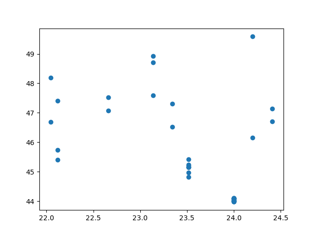

# Quickstart by example

## 1. I want to return the number of sky spectra in a given run (runid=1002850)


```python
from weaveio import *
data = Data() 
runid = 1003453
nsky = sum(data.runs[runid].targuses == 'S')
print("number of sky targets = {}".format(nsky()))
```
output: `number of sky targets = 100`

We can break this down into several steps:

1. `from weaveio import *; data = Data()` - Import all the necessary `weaveio` functions and start the default lofar database link (the default is opr3 but this may change in the future).
2. `data.` - Start building a query using data connection established above
3. `data.runs` - Get all runs
4. `data.runs[runid]` - Filter the runs to those that have their id equal to the variable `runid`. Each run has a unique runid, so you can be sure that this query now contains one row.
5. `data.runs[runid].targuses` - Each run has multiple L1 single spectra associated with it and each of those spectra have a `targuse` attribute. Therefore, each run has multiple `targuse` attributes, therefore you must write `targuses`. 
6. `data.runs[runid].targuses == 'S'` - Make a boolean mask for where the targuse flag for each spectrum belonging to this run is set to `'S'` (this refers to "sky").
7. `nsky = sum(data.runs[runid].targuses == 'S')` - Sum the entire boolean mask, thereby counting the number of sky fibres placed in this run. 
The python function `sum` was overwritten with a `weaveio` version when we did our imports. `sum` is now compatible with `weaveio` but can also be used normally. 
8. `nsky()` - Up til now, we have been building a query, much like we would write SQL, but nothing has executed on the database yet. 
To run our query and fetch the result, we call it using the parentheses `()`.

## 1b. I want to see how many sky targets each run has
```python
from weaveio import *
data = Data()
nsky = sum(data.runs.targuses == 'S', wrt=data.runs)  # sum the number of sky targets with respect to their runs
print(nsky())
```
output: `[100 299 299 100 100 200 160 ...]`

This query is very similar to the previous one except that we are summing over the fibres of each run, not just 1 run as before.
The difference here is that we have missed out `data.runs[runid]` which means that our query references all `runs` in the database at once.

1. `from weaveio import *; data = Data()` - Import all the necessary `weaveio` functions and start the default lofar database link.
2. `data.runs` - Get all runs.
3. `data.runs.targuses == 'S` - Access all `targuse` attributes belonging to each run. Read this statement as "for each run in data, for each targuse in run, do `==S`.
4. `nsky = sum(data.runs.targuses == 'S', wrt=data.runs)` - This time sum our boolean mask *with respect to (`wrt`)* `data.runs`. 
This means each row in the resultant query, `nsky`, will refer to each row in `data.runs`. I.E. There is now a query row *per run*, whereas in the previous example there was only one row.

## 1c. Put the above result into a table where I can see the runid
```python
from weaveio import *
data = Data()
nsky = sum(data.runs.targuses == 'S', wrt=data.runs)  # sum the number of skytargets with respect to their runs
query_table = data.runs[['id', nsky]]  # design a table by using the square brackets
concrete_table = query_table()  # make it "real" by executing the query
print(concrete_table)
print(type(concrete_table))
```
output:
```
   id   sum0
------- ----
1003453  100
1003440  299
...      ...
<class 'weaveio.readquery.results.Table'>  # although this is an astropy table really
```
Returning more than one attribute per row requires "designing" a table.
To do this, we put a list of our required values in the square brackets `[['id', nsky]]`. 
Any string referring to an attribute (e.g. `'id'`) can go here as well as any previously written query (e.g. `nsky`').
However, any items that you put in the square brackets must align with the object outside:

For example:
* `data.runs[['id', nsky]]` is valid because each `run` has an `id` and the query `nsky` is based on `data.runs` (i.e. each `run` has an `nsky` calculated for it).


## 2. I want to plot all single sky spectra from last night in the red arm

```python
from weaveio import *
data = Data()
yesterday = 57811  # state yesterday's date in MJD

runs = data.runs
is_red = runs.camera == 'red'
is_yesterday = floor(runs.exposure.mjd) == yesterday  # round down to an integer, which is the day

runs = runs[is_red & is_yesterday]  # filter the runs to red ones that were taken yesterday  
spectra = runs.l1single_spectra  # get all the spectra per run
sky_spectra = spectra[spectra.targuse == 'S']  # filter to the spectra which are sky 

table = sky_spectra[['wvl', 'flux']]  # design a table of wavelength and flux

import matplotlib.pyplot as plt
# this may take a while to plot, there is a lot of data
for row in table:  # you can iterate over a query with `for` as well as requesting the whole thing with `()` 
    plt.plot(row.wvl, row.flux, 'k-', alpha=0.4)  # standard matplotlib line plot 
plt.savefig('sky_spectra.png')
```
output:



The only new thing in this query is `for row in table`. This implicitly calls the table (`table()`) and downloads one row at a time. 
You will want to do this when the resulting query will be large. By using this "iterator" pattern, you can avoid loading it all into memory at once.


## 3. I want to plot the H-alpha flux vs. L2 redshift distribution from all WL or W-QSO spectra that were observed from all OBs observed in the past month. Use the stacked data

```python
import matplotlib.pyplot as plt
data = Data()
l2s = data.l2stacks
l2s = l2s[(l2s.ob.mjd >= 57780) & any(l2s.fibre_target.surveys == '/WL.*/', wrt=l2s.fibre_target)]
l2s = l2s[l2s['ha_6562.80_flux'] > 0]
table = l2s[['ha_6562.80_flux', 'z']]()
plt.scatter(table['z'], table['ha_6562.80_flux'], s=1)
plt.yscale('log')
plt.savefig('ha-z.png') 
```




Let's break down this query:

1. `l2s = data.l2stacks` gets all l2stack products in the database. These are the data products which contain joined spectra and template fits.
2. `l2s.fibre_target.surveys == '/WL.*/'` - This creates a boolean mask matching the survey name to 'WL.*' with regex. You can activate regex by using `/` at the start and end of a string.
3. `l2s = l2s[(l2s.ob.mjd >= 57780) & any(l2s.fibre_target.surveys == '/WL.*/', wrt=l2s.fibre_target)]` - This filters to l2 products whose L1 observations were taken after 57780
and survey names containing "WL"
4. `l2s = l2s[l2s['ha_6562.80_flux'] > 0]` - Then we further filter the l2 products by required an halpha flux greater than 0 (fit by Gandalf).
5. `l2s[['ha_6562.80_flux', 'z']]` - This designs a table with the halpha flux (from gandalf) and the redshift (from redrock)

## 4a. Join on a 3rd party catalogue
Given a catalogue of weave cnames, find those objects in the database and return the calendar dates on which those matched objects were observed, and the number of WEAVE visits to each CNAME (there could be more than one)

To do this we need to use `join` which is imported from `weaveio`. 
`join` takes at least 3 arguments: the first is the table to join on, the second is the column name in that table, and the third is the object in `weaveio` to join to.
You may also specify a `join_query` which is another `weaveio` query that results in the attribute to join to. If this is not specified, then it is assumed that the attribute should be the same as the column name in the table.
```python
def join(table: Table, index_column: str,
         object_query: ObjectQuery, join_query: Union[AttributeQuery, str] = None,
         join_type: str = 'left') -> Tuple[TableVariableQuery, ObjectQuery]:
    ...
```
The output of `join` is the input table converted to a `weaveio` variable and a reduced version of the input `object_query`.
The output table variable should now be treated as rows.

```python
from astropy.table import Table
from weaveio import *
import weaveio
fname = Path(weaveio.__file__).parents[0] / 'tests/my_table.ascii'
data = Data()
table = Table.read(fname, format='ascii')
rows, targets = join(table, 'cname', data.weave_targets)
mjds = targets.exposures.mjd  # get the mjd of the plate exposures for each target
q = targets['cname', rows['modelMag_i'], {'mjds': mjds, 'nobservations': count(mjds, wrt=targets)}]
print(q())
```
output:
```
       cname         modelMag_i          mjds [15]           nobservations
-------------------- ---------- ---------------------------- -------------
WVE_10461805+5755400   20.20535 57809.109711 .. 57811.075961            15
WVE_10521675+5814292    21.2665 57809.109711 .. 57811.075961            15
WVE_10521675+5814292    21.2665 57809.109711 .. 57811.075961            15
WVE_02175674-0451074   21.38155             57640.1764 .. --             6
WVE_02174727-0459587   21.81214             57640.1764 .. --             6
WVE_02175411-0504122   22.28189             57640.1764 .. --             6
WVE_02175687-0512209   21.79577             57640.1764 .. --             6
WVE_02174991-0454427   21.65417             57640.1764 .. --             6
WVE_02175370-0448267   19.63735             57640.1764 .. --             6
WVE_02174862-0457336     22.181             57640.1764 .. --             6
WVE_02175320-0508011   20.16733             57640.1764 .. --             6
```
Breaking down this query:
1. `table = Table.read('weaveio/tests/my_table.ascii', format='ascii')` - This reads in a custom table from the file `my_table.ascii`. One of the column names is `cname`.
2. `rows, targets = join(table, 'cname', data.weave_targets)` - This joins the `cname` column of the table to the `cname` attribute of the weave targets catalogue.
`targets` will refer to all `weave_targets` that were matched by the `cname` column and `rows` will refer to the rows of the table.
3. `mjds = targets.exposures.mjd ` - This gets the mjd of the plate exposures for each target (there may be more than 1) and each exposure will have 2 `l1single_spectra` (one for each arm), although we don't worry about that yet. 
4. `q = targets['cname', rows['modelMag_i'], {'mjds': mjds, 'nobservations': count(mjds, wrt=targets)}]` - This creates a table using the 'modelMag_i' found in the fits file table. This can be done because we joined it earlier.
Here we are also renaming columns to more human readable names using a dictionary. 

### Ragged arrays
The mjd result column is "ragged" array since there may be more than 1 exposure per target and that is not constant for each target.
So that the user can aggregate easily we convert the mjd result column to a regular array and mask it.

## 4b. Plot sdss modelMag_i from the fits file against mean flux between 400-450nm
Continuing from 4a, we first traverse to the `l1single_spectra` and fetch their wavelengths and fluxes.
Then we plot the modelMag_i from the fits file against the mean flux between 400-450nm.

```python
import matplotlib.pyplot as plt

q = targets.l1single_spectra[['cname', rows['modelMag_g'], 'wvl', 'flux', 'sensfunc']]
table = q()
mean_fluxes = []
for row in table:
    filt = (row['wvl'] > 4000) & (row['wvl'] < 4500)  # angstroms
    mean_fluxes.append(mean(row['flux'][filt]))
table['mean_flux'] = mean_fluxes
print(table['mean_flux'])
plt.scatter(table['modelMag_g'], -2.5 * np.log10(table['mean_flux']))
plt.show()
```
output:
```
      mean_flux      
---------------------
   1.6613570457103553
   1.8225295509082666
   1.6668027617324288
                   --
   1.8113559953805027
                   --
    1.685038564203977
                  ...
                   --
 -0.07946323931008473
                   --
-0.012973852190988072
 -0.13294200506014725
                   --
                   --
Length = 90 rows
```


## 5. For each OB at a time, retrieve all the stacked red-arm sky spectra and the single spectra that went into making those stacked spectra
```python
from weaveio import *
data = Data()

obs = split(data.obs)  # mark the fact that you want have one table per OB thereby "splitting" the query in to multiple queries
stacks = obs.l1stack_spectra[(obs.l1stack_spectra.targuse == 'S') & (obs.l1stack_spectra.camera == 'red')]
singles = stacks.l1single_spectra
singles_table =  singles[['flux', 'ivar']]
query = stacks[[stacks.obs.id, {'stack_flux': 'flux', 'stack_ivar': 'ivar'}, 'wvl', {'single_': singles_table}]]

for index, ob_query in query:
    print(f"stacks and singles for OB #{index}:")
    print(ob_query())
```
output:
```
stacks and singles for OB #3133:
ob.id stack_flux [15289] ... single_flux [3,15289] single_ivar [3,15289]
----- ------------------ ... --------------------- ---------------------
 3133         0.0 .. 0.0 ...            0.0 .. 0.0            0.0 .. 0.0
 3133         0.0 .. 0.0 ...            0.0 .. 0.0            0.0 .. 0.0
 3133         0.0 .. 0.0 ...            0.0 .. 0.0            0.0 .. 0.0
 3133         0.0 .. 0.0 ...            0.0 .. 0.0            0.0 .. 0.0
 3133         0.0 .. 0.0 ...            0.0 .. 0.0            0.0 .. 0.0
 3133         0.0 .. 0.0 ...            0.0 .. 0.0            0.0 .. 0.0
 3133         0.0 .. 0.0 ...            0.0 .. 0.0            0.0 .. 0.0
 3133         0.0 .. 0.0 ...            0.0 .. 0.0            0.0 .. 0.0
 3133         0.0 .. 0.0 ...            0.0 .. 0.0            0.0 .. 0.0
 3133         0.0 .. 0.0 ...            0.0 .. 0.0            0.0 .. 0.0
```
Breaking down this query:

There are two new concepts in this example: query splitting and adding tables together.

1. Splitting occurs with `obs = split(data.obs)`. 
Nothing special happens here except that we have now marked that any query that follows from `obs` will yield more than one table.
Each table will have a different `ob.id` value
2. We continue our query as normal
3. `query = stacks[['ob.id', {'stack_flux': 'flux', 'stack_ivar': 'ivar'}, 'wvl', {'single_': singles_table}]]` - Here we have now added the `singles_table` into a new table we are constructing.
This is equivalent to `query = stacks[['ob.id', {'stack_flux': 'flux', 'stack_ivar': 'ivar'}, 'wvl', {'single_flux': singles['flux'], 'single_ivar': singles['ivar']}]]`. 
When renaming the additional table (with `{'single_': ...}`) we are added a prefix onto each of the new columns.
4. `for index, ob_query in query:` - `query` is now split query, so when we iterate over it we get one table for each ob.id value. 
It also returns an index, which in this case is just the `ob.id` value. `ob_query` is now identical to the original `query` except that is will only return results for one OB.
5. `ob_query()` - Execute the query only for the current OB (the one with `ob.id == index`).

`split` is the equivalent function to `group_by` in pandas or astropy. However, you must perform a `split` before querying whereas in a pandas/astropy `group_by` it is done after the fact.

Also, it is important to note that the `single_flux` and `single_ivar` columns are 2 dimensional since there are 3 single spectra per stack spectrum. 
So you get all 3 at once, per row of the query.


